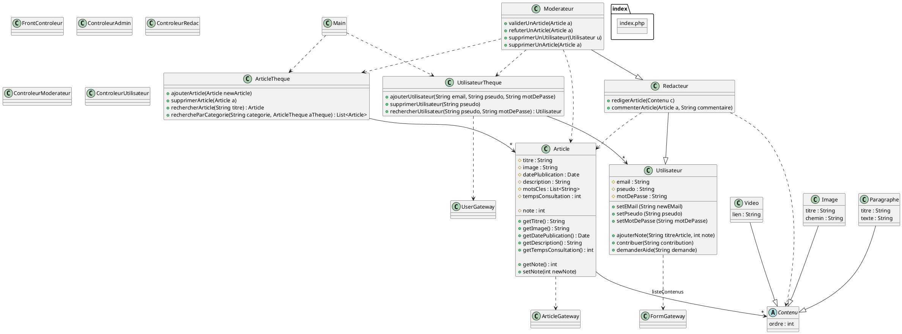

# Diagramme de classe

## Le M est sérializable

```plantuml
@startuml
object index.php

class FrontControleur{

}

class ControleurAdmin{

}

class ControleurRedac{

}

class ControleurModerateur{

}

class ControleurUtilisateur{

}


class Main{

}

class Article{
    # titre : String
    # image : String
    # datePlublication : Date
    # description : String
    # motsCles : List<String>
    # tempsConsultation : int

    # note : int

    + getTitre() : String
    + getImage() : String
    + getDatePublication() : Date
    + getDescription() : String
    + getTempsConsultation() : int

    + getNote() : int
    + setNote(int newNote)

}

abstract class Contenu{
    ordre : int
}
class Image{
    titre : String
    chemin : String
}
class Paragraphe{
    titre : String
    texte : String
}
class Video{
    lien : String
}

class ArticleTheque{

    + ajouterArticle(Article newArticle)
    + supprimerArticle(Article a)
    + rechercherArticle(String titre) : Article
    + rechercheParCategorie(String categorie, ArticleTheque aTheque) : List<Article>
}

class Utilisateur{
    # email : String
    # pseudo : String
    # motDePasse : String

    + setEMail (String newEMail)
    + setPseudo (String pseudo)
    + setMotDePasse (String motDePasse)

    + ajouterNote(String titreArticle, int note)
    + contribuer(String contribution)
    + demanderAide(String demande)
}
class UtilisateurTheque{


    + ajouterUtilisateur(String email, String pseudo, String motDePasse)
    + supprimerUtilisateur(String pseudo)
    + rechercherUtilisateur(String pseudo, String motDePasse) : Utilisateur
}

class Redacteur{

    + redigerArticle(Contenu c)
    + commenterArticle(Article a, String commentaire)
}

class Moderateur{

    + validerUnArticle(Article a)
    + refuterUnArticle(Article a)
    + supprimerUnUtilisateur(Utilisateur u)
    + supprimerUnArticle(Article a)
}


ArticleTheque --> "*" Article
Article --> "*" Contenu : "listeContenus"
Main ..> ArticleTheque

Paragraphe --|> Contenu
Image --|> Contenu
Video --|> Contenu

UtilisateurTheque --> "*" Utilisateur
UtilisateurTheque ..> UserGateway
Main ..> UtilisateurTheque

Utilisateur ..> FormGateway

Article ..> ArticleGateway

Redacteur ..> Article
Redacteur ..> Contenu

Moderateur ..> Article
Moderateur ..> ArticleTheque
Moderateur ..> UtilisateurTheque

Redacteur --|> Utilisateur
Moderateur --|> Redacteur


@enduml
```