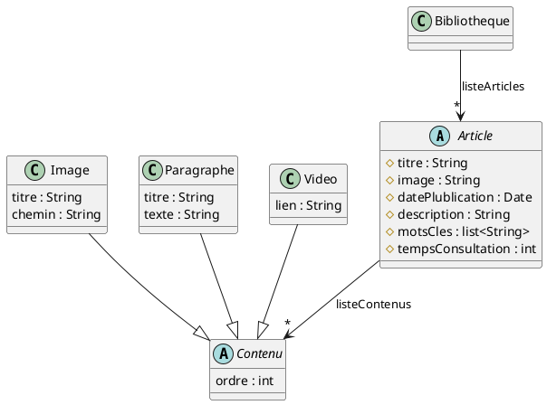

# Diagramme de classe

```plantuml
@startuml

abstract class Article{
    # titre : String
    # image : String
    # datePlublication : Date
    # description : String
    # motsCles : list<String>
    # tempsConsultation : int
}
abstract class Contenu{
    ordre : int
}
class Image{
    titre : String
    chemin : String
}
class Paragraphe{
    titre : String
    texte : String
}
class Video{
    lien : String
}
class Bibliotheque{}


Article --> "*" Contenu : "listeContenus"
Bibliotheque --> "*" Article : "listeArticles"

Paragraphe --|> Contenu
Image --|> Contenu
Video --|> Contenu


@enduml
```