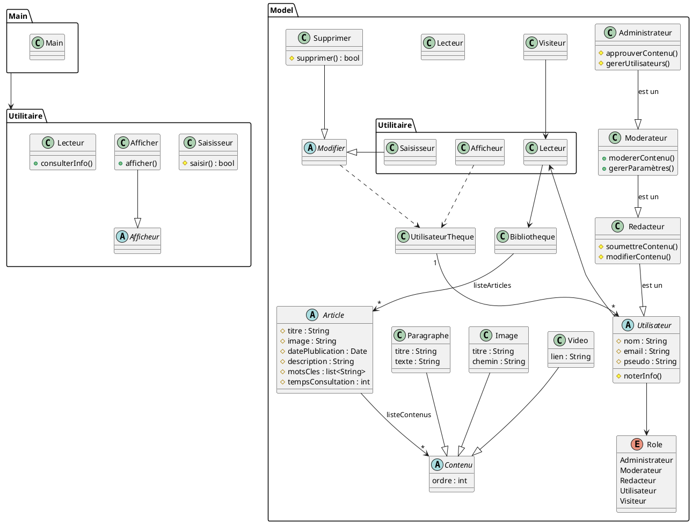

# Diagramme de classe

```plantuml
@startuml
namespace Main{
    class Main{}
}
namespace Model{
    class Visiteur{
    }
    abstract Utilisateur {
        # nom : String
        # email : String
        # pseudo : String
        # noterInfo() 
    }
    class Redacteur {
        # soumettreContenu()
        # modifierContenu()
    }
    class Administrateur {
        # approuverContenu()
        # gererUtilisateurs()
    }
    class Moderateur {
        + modererContenu()
        + gererParamètres()
    }
    class UtilisateurTheque {
    } 
    class Lecteur{
    }
    abstract Modifier {
    }
    class Supprimer {
        # supprimer() : bool
    }

    enum Role{
        Administrateur
        Moderateur
        Redacteur
        Utilisateur
        Visiteur
    }

    abstract class Article{
        # titre : String
        # image : String
        # datePlublication : Date
        # description : String
        # motsCles : list<String>
        # tempsConsultation : int
    }
    abstract class Contenu{
        ordre : int
    }
    class Image{
        titre : String
        chemin : String
    }
    class Paragraphe{
        titre : String
        texte : String
    }
    class Video{
        lien : String
    }
    class Bibliotheque{}


    Article --> "*" Contenu : "listeContenus"
    Bibliotheque --> "*" Article : "listeArticles"

    Paragraphe --|> Contenu
    Image --|> Contenu
    Video --|> Contenu

    Redacteur --|> Utilisateur : est un
    Moderateur --|>  Redacteur : est un
    Administrateur --|> Moderateur : est un 
    Utilisateur -->Role

    Utilitaire.Lecteur --> Bibliotheque
    UtilisateurTheque "1" --> "*"  Utilisateur
    Modifier ..> UtilisateurTheque
    Supprimer --|> Modifier

    Utilisateur --> Utilitaire.Lecteur
    Visiteur --> Utilitaire.Lecteur
    Utilitaire.Saisisseur --|> Modifier
    Utilitaire.Afficheur ..> UtilisateurTheque
}

namespace Utilitaire{
    class Saisisseur {
        # saisir() : bool
    }
    abstract Afficheur {
        
    }
    class Afficher {
        + afficher()
    }
    class Lecteur {
        + consulterInfo()
    }
    Afficher --|> Afficheur
}
    
Main --> Utilitaire
 

@enduml

```

