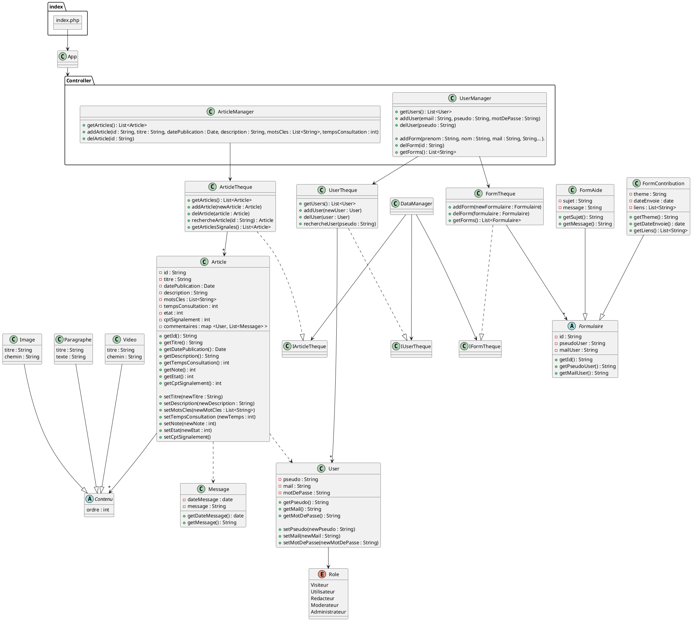

# Diagramme de classe

```plantuml
@startuml

object index.php

class App{

}
package Controller{
    class ArticleManager{

        + getArticles() : List<Article>
        + addArticle(id : String, titre : String, datePublication : Date, description : String, motsCles : List<String>, tempsConsultation : int)
        + delArticle(id : String)
    }
    class UserManager{

        + getUsers() : List<User>
        + addUser(email : String, pseudo : String, motDePasse : String)
        + delUser(pseudo : String)

        + addForm(prenom : String, nom : String, mail : String, String... ).
        + delForm(id : String)
        + getForms() : List<String>
    }
}

class ArticleTheque{

    + getArticles() : List<Article>
    + addArticle(newArticle : Article)
    + delArticle(article : Article)
    + rechercheArticle(id : String) : Article
    + getArticlesSignales() : List<Article>
}
class Article{
    - id : String
    - titre : String
    - datePublication : Date
    - description : String
    - motsCles : List<String>
    - tempsConsultation : int
    - etat : int
    - cptSignalement : int
    - commentaires : map <User, List<Message> > 

    + getId() : String
    + getTitre() : String
    + getDatePublication() : Date
    + getDescription() : String
    + getTempsConsultation() : int
    + getNote() : int
    + getEtat() : int
    + getCptSignalement() : int

    + setTitre(newTitre : String)
    + setDescription(newDescription : String)
    + setMotsCles(newMotCles : List<String>)
    + setTempsConsultation (newTemps : int)
    + setNote(newNote : int)
    + setEtat(newEtat : int)
    + setCptSignalement()
}
abstract Contenu{
    ordre : int
}
class Image{
    titre : String
    chemin : String
}
class Paragraphe{
    titre : String
    texte : String
}
class Video{
    titre : String
    chemin : String
}

class Message{
    - dateMessage : date
    - message : String

    + getDateMessage() : date
    + getMessage() : String
}

class UserTheque{
    
    + getUsers() : List<User>
    + addUser(newUser : User)
    + delUser(user : User)
    + rechercheUser(pseudo : String)
}
class User{
    - pseudo : String
    - mail : String
    - motDePasse : String

    + getPseudo() : String
    + getMail() : String
    + getMotDePasse() : String

    + setPseudo(newPseudo : String)
    + setMail(newMail : String)
    + setMotDePasse(newMotDePasse : String)
}
enum Role{
    Visiteur
    Utilisateur
    Redacteur
    Moderateur
    Administrateur
}

class FormTheque{
    + addForm(newFormulaire : Formulaire)
    + delForm(formulaire : Formulaire)
    + getForms() : List<Formulaire>
}
abstract Formulaire{
    - id : String
    - pseudoUser : String
    - mailUser : String

    + getId() : String
    + getPseudoUser() : String
    + getMailUser() : String
}
class FormAide{
    - sujet : String
    - message : String

    + getSujet() : String
    + getMessage() : String
}
class FormContribution{
    - theme : String
    - dateEnvoie : date
    - liens : List<String> 

    + getTheme() : String
    + getDateEnvoie() : date
    + getLiens() : List<String>
}

class DataManager{}

index.php --> App
App --> Controller

ArticleManager --> ArticleTheque
ArticleTheque --> "*" Article
Article --> "*" Contenu
Image --|> Contenu
Paragraphe --|> Contenu
Video --|> Contenu
Article ..> Message
Article ..> User

UserManager --> UserTheque
UserTheque --> "*" User
User --> Role

UserManager --> FormTheque
FormTheque --> "*" Formulaire
FormAide --|> Formulaire
FormContribution --|> Formulaire


ArticleTheque ..|> IArticleTheque
UserTheque ..|> IUserTheque
FormTheque ..|> IFormTheque
DataManager --> IArticleTheque
DataManager --> IUserTheque
DataManager --> IFormTheque


@enduml

```

