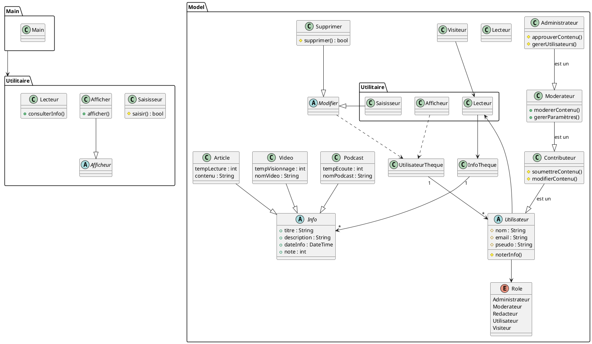

# Diagramme de classe

```plantuml
@startuml
namespace Main{
    class Main{}
}
namespace Model{
    class Visiteur{
    }
    abstract Utilisateur {
        # nom : String
        # email : String
        # pseudo : String
        # noterInfo() 
    }
    class Lecteur{
    }
    class Contributeur {
        # soumettreContenu()
        # modifierContenu()
    }
    class Administrateur {
        # approuverContenu()
        # gererUtilisateurs()
    }
    class Moderateur {
        + modererContenu()
        + gererParamètres()
    }
    class UtilisateurTheque {
    } 
    abstract Modifier {
    }
    class Supprimer {
        # supprimer() : bool
    }
    class InfoTheque {
    }
    abstract Info {
        + titre : String
        + description : String
        + dateInfo : DateTime
        + note : int
    }
    class Article {
        tempLecture : int
        contenu : String
    }
    class Podcast {
        tempEcoute : int
        nomPodcast : String
    }
    class Video {
        tempVisionnage : int
        nomVideo : String
    }
    enum Role{
        Administrateur
        Moderateur
        Redacteur
        Utilisateur
        Visiteur
    }

    InfoTheque "1" --> "*"  Info
    Podcast --|> Info
    Article --|> Info
    Video --|> Info

    Contributeur --|> Utilisateur : est un
    Moderateur --|>  Contributeur : est un
    Administrateur --|> Moderateur : est un 
    Utilisateur -->Role

    UtilisateurTheque "1" --> "*"  Utilisateur
    Modifier ..> UtilisateurTheque
    Supprimer --|> Modifier

    Utilitaire.Lecteur --> InfoTheque
    Utilisateur --> Utilitaire.Lecteur
    Visiteur --> Utilitaire.Lecteur
    Utilitaire.Saisisseur --|> Modifier
    Utilitaire.Afficheur ..> UtilisateurTheque
}

namespace Utilitaire{
    class Saisisseur {
        # saisir() : bool
    }
    abstract Afficheur {
        
    }
    class Afficher {
        + afficher()
    }
    class Lecteur {
        + consulterInfo()
    }
    Afficher --|> Afficheur
}
    
Main --> Utilitaire
 

@enduml

```

