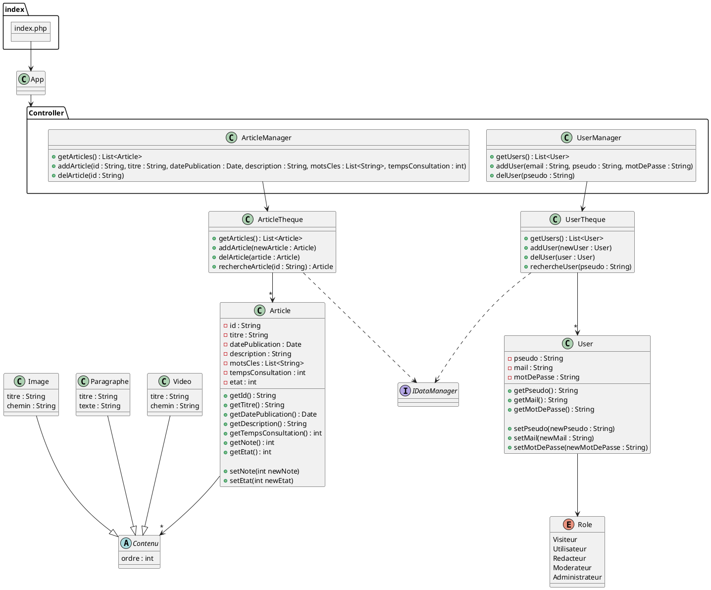

# Diagramme de classe

```plantuml
@startuml

object index.php

class App{

}
package Controller{
    class ArticleManager{

        + getArticles() : List<Article>
        + addArticle(id : String, titre : String, datePublication : Date, description : String, motsCles : List<String>, tempsConsultation : int)
        + delArticle(id : String)
    }
    class UserManager{

        + getUsers() : List<User>
        + addUser(email : String, pseudo : String, motDePasse : String)
        + delUser(pseudo : String)
    }
}

class ArticleTheque{

    + getArticles() : List<Article>
    + addArticle(newArticle : Article)
    + delArticle(article : Article)
    + rechercheArticle(id : String) : Article
}
class Article{
    - id : String
    - titre : String
    - datePublication : Date
    - description : String
    - motsCles : List<String>
    - tempsConsultation : int
    - etat : int

    + getId() : String
    + getTitre() : String
    + getDatePublication() : Date
    + getDescription() : String
    + getTempsConsultation() : int
    + getNote() : int
    + getEtat() : int

    + setNote(int newNote)
    + setEtat(int newEtat)
}
abstract Contenu{
    ordre : int
}
class Image{
    titre : String
    chemin : String
}
class Paragraphe{
    titre : String
    texte : String
}
class Video{
    titre : String
    chemin : String
}

class UserTheque{
    
    + getUsers() : List<User>
    + addUser(newUser : User)
    + delUser(user : User)
    + rechercheUser(pseudo : String)
}
class User{
    - pseudo : String
    - mail : String
    - motDePasse : String

    + getPseudo() : String
    + getMail() : String
    + getMotDePasse() : String

    + setPseudo(newPseudo : String)
    + setMail(newMail : String)
    + setMotDePasse(newMotDePasse : String)
}
enum Role{
    Visiteur
    Utilisateur
    Redacteur
    Moderateur
    Administrateur
}

interface IDataManager{}

index.php --> App
App --> Controller

ArticleManager --> ArticleTheque
ArticleTheque --> "*" Article
Article --> "*" Contenu
Image --|> Contenu
Paragraphe --|> Contenu
Video --|> Contenu

UserManager --> UserTheque
UserTheque --> "*" User
User --> Role

ArticleTheque ..> IDataManager
UserTheque ..> IDataManager

@enduml

```

