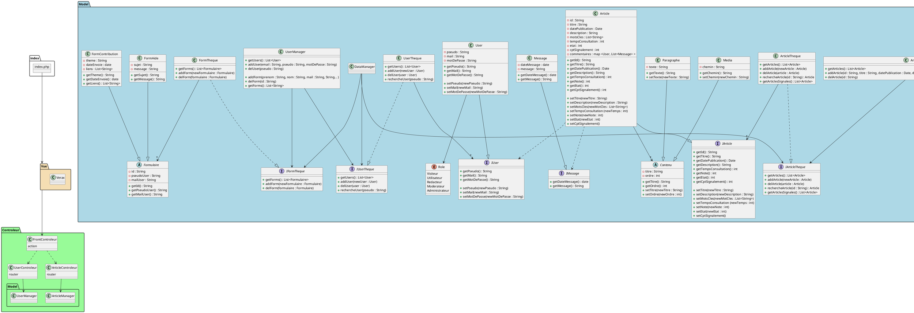

# Diagramme de classe

```plantuml
@startuml

object index.php

Package Vue #Wheat{
    class Verax
}

index.php --> Vue
Vue --> Controleur.FrontControleur

package Controleur #PaleGreen{
    class FrontControleur{
        action
    }
    class UserControleur{
        router
    }
    class ArticleControleur{
        router
    }

    ArticleControleur --> Model.ArticleManager
    UserControleur --> Model.UserManager

    FrontControleur ..> ArticleControleur
    FrontControleur ..> UserControleur
}

package Model #LightBlue{
    class ArticleManager{

        + getArticles() : List<Article>
        + addArticle(id : String, titre : String, datePublication : Date, description : String, motsCles : List<String>, tempsConsultation : int)
        + delArticle(id : String)
    }
    class UserManager{

        + getUsers() : List<User>
        + addUser(email : String, pseudo : String, motDePasse : String)
        + delUser(pseudo : String)

        + addForm(prenom : String, nom : String, mail : String, String... )
        + delForm(id : String)
        + getForms() : List<String>
    }


    class ArticleTheque{

        + getArticles() : List<Article>
        + addArticle(newArticle : Article)
        + delArticle(article : Article)
        + rechercheArticle(id : String) : Article
        + getArticlesSignales() : List<Article>
    }
    interface IArticleTheque{
        + getArticles() : List<Article>
        + addArticle(newArticle : Article)
        + delArticle(article : Article)
        + rechercheArticle(id : String) : Article
        + getArticlesSignales() : List<Article>
    }
    class Article{
        - id : String
        - titre : String
        - datePublication : Date
        - description : String
        - motsCles : List<String>
        - tempsConsultation : int
        - etat : int
        - cptSignalement : int
        - commentaires : map <User, List<Message> > 

        + getId() : String
        + getTitre() : String
        + getDatePublication() : Date
        + getDescription() : String
        + getTempsConsultation() : int
        + getNote() : int
        + getEtat() : int
        + getCptSignalement() : int

        + setTitre(newTitre : String)
        + setDescription(newDescription : String)
        + setMotsCles(newMotCles : List<String>)
        + setTempsConsultation (newTemps : int)
        + setNote(newNote : int)
        + setEtat(newEtat : int)
        + setCptSignalement()
    }
    interface IArticle{
        + getId() : String
        + getTitre() : String
        + getDatePublication() : Date
        + getDescription() : String
        + getTempsConsultation() : int
        + getNote() : int
        + getEtat() : int
        + getCptSignalement() : int

        + setTitre(newTitre : String)
        + setDescription(newDescription : String)
        + setMotsCles(newMotCles : List<String>)
        + setTempsConsultation (newTemps : int)
        + setNote(newNote : int)
        + setEtat(newEtat : int)
        + setCptSignalement()
    }
    abstract Contenu{
        - titre : String
        - ordre : int
        
        + getTitre() : String
        + getOrdre() : int
        + setTitre(newTitre : String)
        + setOrdre(newOrdre : int)
        
    }
    class Media{
        - chemin : String

        + getChemin() : String
        + setChemin(newChemin : String)
    }
    class Paragraphe{
        - texte : String

        + getTexte() : String
        + setTexte(newTexte : String)
    }

    class Message{
        - dateMessage : date
        - message : String

        + getDateMessage() : date
        + getMessage() : String
    }
    interface IMessage{
        + getDateMessage() : date
        + getMessage() : String
    }

    class UserTheque{
        
        + getUsers() : List<User>
        + addUser(newUser : User)
        + delUser(user : User)
        + rechercheUser(pseudo : String)
    }
    interface IUserTheque{
        + getUsers() : List<User>
        + addUser(newUser : User)
        + delUser(user : User)
        + rechercheUser(pseudo : String)
    }
    class User{
        - pseudo : String
        - mail : String
        - motDePasse : String

        + getPseudo() : String
        + getMail() : String
        + getMotDePasse() : String

        + setPseudo(newPseudo : String)
        + setMail(newMail : String)
        + setMotDePasse(newMotDePasse : String)
    }
    interface IUser{
        + getPseudo() : String
        + getMail() : String
        + getMotDePasse() : String

        + setPseudo(newPseudo : String)
        + setMail(newMail : String)
        + setMotDePasse(newMotDePasse : String)
    }
    enum Role{
        Visiteur
        Utilisateur
        Redacteur
        Moderateur
        Administrateur
    }

    class FormTheque{
        + getForms() : List<Formulaire>
        + addForm(newFormulaire : Formulaire)
        + delForm(formulaire : Formulaire)
    }
    interface IFormTheque{
        + getForms() : List<Formulaire>
        + addForm(newFormulaire : Formulaire)
        + delForm(formulaire : Formulaire)
    }
    abstract Formulaire{
        - id : String
        - pseudoUser : String
        - mailUser : String

        + getId() : String
        + getPseudoUser() : String
        + getMailUser() : String
    }
    class FormAide{
        - sujet : String
        - message : String

        + getSujet() : String
        + getMessage() : String
    }
    class FormContribution{
        - theme : String
        - dateEnvoie : date
        - liens : List<String> 

        + getTheme() : String
        + getDateEnvoie() : date
        + getLiens() : List<String>
    }

    class DataManager{}


    ArticleManager --> IArticleTheque
    ArticleTheque --> "*" IArticle
    Article --|> IArticle
    Article --> "*" Contenu
    Paragraphe --|> Contenu
    Media --|> Contenu
    Article ..> IMessage
    Message --|> IMessage
    Article ..> IUser

    UserManager --> IUserTheque
    UserTheque --> "*" IUser
    User --|> IUser
    User --> Role

    UserManager --> IFormTheque
    FormTheque --> "*" Formulaire
    FormAide --|> Formulaire
    FormContribution --|> Formulaire

    ArticleTheque ..|> IArticleTheque
    UserTheque ..|> IUserTheque
    FormTheque ..|> IFormTheque
    DataManager --> IArticleTheque
    DataManager --> IUserTheque
    DataManager --> IFormTheque

}

@enduml

```

